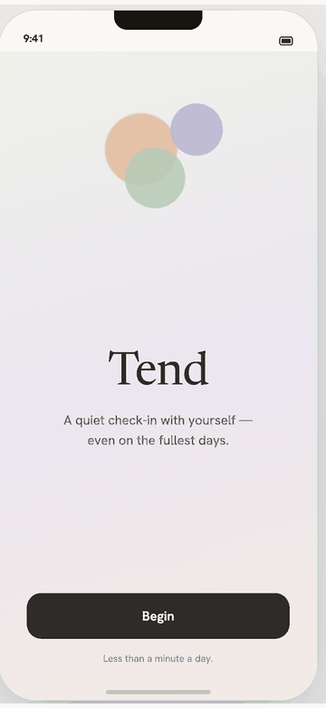
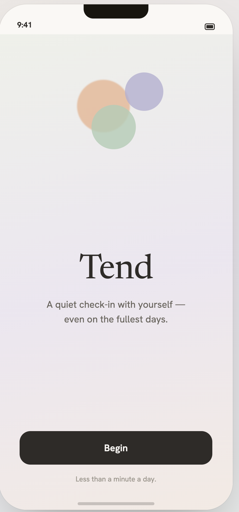
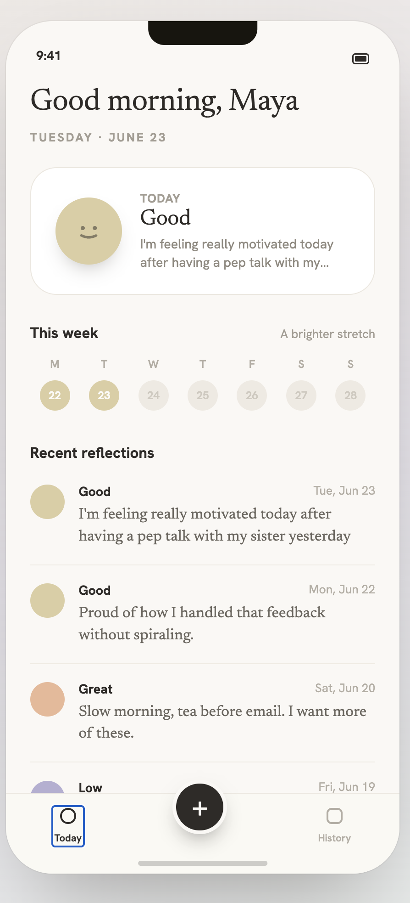
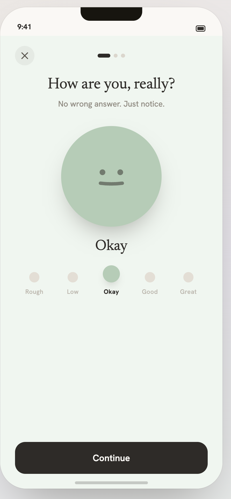
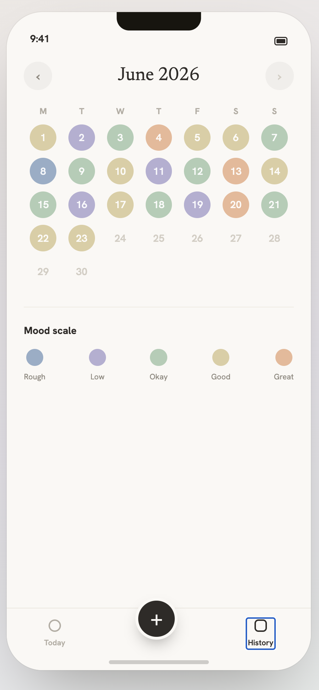
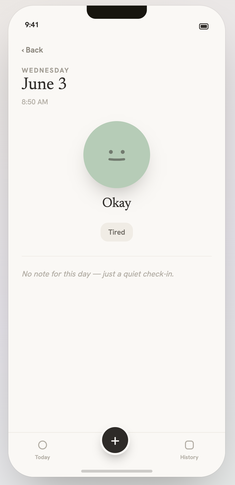

# Tend

A calm, minimal mood-tracking app for high-achieving people who struggle to check in with themselves during busy seasons. Built with .NET MAUI, designed around a single morphing **mood orb** that merges a 1–5 scale, a pastel color, and an emotive face into one quiet daily ritual.

This is also a working demo of [LaunchDarkly](https://launchdarkly.com) mobile **observability** + **session replay** — every meaningful user action emits a span, and screen activity is recorded with text-input masking applied automatically.

---

## Screens

<p align="center">
  
</p>

<details>
<summary>See each screen on its own</summary>

<table>
  <tr>
    <td align="center"><br/><sub><b>Onboarding</b></sub></td>
    <td align="center"><br/><sub><b>Today</b></sub></td>
    <td align="center"><br/><sub><b>Check-in</b></sub></td>
  </tr>
  <tr>
    <td align="center"><br/><sub><b>History</b></sub></td>
    <td align="center"><br/><sub><b>Entry detail</b></sub></td>
    <td></td>
  </tr>
</table>

</details>

---

## What it does

- **Onboarding** — a quiet wordmark and a single Begin button. Shown once.
- **Today** — time-of-day greeting, today's status card (empty CTA or logged orb + truncated note), a Monday-start week strip with mood-colored dots, recent reflections, and a one-line weekly insight (*A brighter stretch* / *Mostly steady* / *A heavier few days*).
- **Check-in** — three light steps:
  1. **Mood scale.** Tap one of five points; the orb's color and face morph live, and the page picks up a faint tint of the chosen mood.
  2. **Feeling tags.** Multi-select from a fixed vocabulary (Calm, Grateful, Tired, Anxious, Hopeful, Overwhelmed, Content, Energized, Proud, Stressed, Peaceful, Focused, Lonely, Restless).
  3. **Journal note.** Optional serif editor. Saving writes an entry under today's date.
- **History** — a month calendar with Mon-start week. Logged days render as mood-colored circles; tap one to open its entry detail. Bottom of the page carries the 5-step mood-scale legend.
- **Entry detail** — back chevron, weekday eyebrow + serif date, time, big orb + label, feeling chips, and the full note (or an italic empty-state line when there is none).

## The mood scale

| Score | Label | Color (pastel) |
|------:|:------|:---------------|
| 1 | Rough | dusty blue `#A8B8C9` |
| 2 | Low   | lavender   `#B6AECC` |
| 3 | Okay  | sage       `#B7CDB3` |
| 4 | Good  | sand       `#D4C896` |
| 5 | Great | apricot    `#E8B898` |

The orb's mouth is a quadratic curve whose control point shifts by score — frown at 1, neutral at 3, smile at 5. All five colors share low chroma so the screen never shouts.

---

## Tech stack

- **.NET MAUI** (net10.0) targeting **iOS** and **Android**
- **CommunityToolkit.Mvvm** for source-generated `ObservableProperty` / `RelayCommand`
- **MAUI `Preferences`** for local JSON-serialized persistence
- **LaunchDarkly Client SDK** (`5.x`) — feature flags
- **LaunchDarkly Observability** — traces wrapped around user actions
- **LaunchDarkly Session Replay** (`0.x`) — text-input masking on by default

> Build targets: `net10.0-ios` and `net10.0-android`. MacCatalyst is **not** supported by `LaunchDarkly.SessionReplay 0.10.x` (it ships binaries only for `net9.0-ios` and `net9.0-android`).

## Project layout

```
mood-tracker/
├── App.xaml(.cs)                    application root + resource dictionaries
├── AppShell.xaml(.cs)               Shell with Login + Onboarding + main TabBar
├── MauiProgram.cs                   DI registration + LaunchDarkly client bootstrap
│
├── Models/
│   ├── MoodScore.cs                 1–5 enum + Label/Color extensions
│   ├── MoodEntry.cs                 date, score, feelings, note, time
│   └── FeelingTag.cs                fixed feeling vocabulary
│
├── Services/
│   ├── IEntryStore.cs               GetAll / GetByDate / Upsert
│   └── EntryStore.cs                Preferences-backed JSON store, seeds demo data once
│
├── Controls/
│   └── MoodOrbView.cs               reusable pastel orb with morphing face
│
├── Converters/
│   ├── InvertedBoolConverter.cs
│   ├── ScoreToLabelConverter.cs
│   └── HasNoteToFontAttrConverter.cs
│
├── ViewModels/
│   ├── BaseViewModel.cs
│   ├── LoginViewModel.cs
│   ├── OnboardingViewModel.cs
│   ├── TodayViewModel.cs            + DayDot, ReflectionRow
│   ├── CheckInViewModel.cs          + MoodOption, FeelingChip
│   ├── HistoryViewModel.cs          + CalendarCell, MoodLegendItem
│   └── EntryDetailViewModel.cs
│
├── Pages/
│   ├── LoginPage.xaml(.cs)
│   ├── OnboardingPage.xaml(.cs)
│   ├── TodayPage.xaml(.cs)
│   ├── CheckInPage.xaml(.cs)
│   ├── HistoryPage.xaml(.cs)
│   └── EntryDetailPage.xaml(.cs)
│
├── Observability/
│   └── LDConfig.cs                  mobile key, service name, feature flag keys
│
└── Resources/Styles/
    ├── Colors.xaml                  Tend palette tokens + mood pastels
    └── Styles.xaml                  typography, page bg, card border, etc.
```

---

## Getting started

### Prerequisites

- macOS with Xcode (for iOS) or Android SDK/emulator (for Android)
- .NET 10 SDK with the MAUI workload:
  ```sh
  dotnet workload install maui
  ```

### Configure LaunchDarkly

Tend ships with a placeholder LaunchDarkly **mobile key** in `Observability/LDConfig.cs`. Replace it with a key from your own LaunchDarkly project (Account → Projects → Environments → mobile SDK key):

```csharp
public const string MobileKey   = "mob-XXXXXXXX-...";
public const string ServiceName = "mood-tracker-maui-demo";
```

If you skip this step the app still runs locally — LaunchDarkly just won't receive anything.

### Build

```sh
# iOS simulator
dotnet build -f net10.0-ios

# Android
dotnet build -f net10.0-android
```

### Run

Use your IDE (Visual Studio, Rider, VS Code with the .NET MAUI extension) to deploy to a simulator/emulator or device. From the CLI:

```sh
# iOS simulator
dotnet build -t:Run -f net10.0-ios

# Android emulator
dotnet build -t:Run -f net10.0-android
```

First launch flows through **Login → Onboarding → Today**. After onboarding completes once, subsequent launches go straight from Login to Today (the flag is stored in `Preferences` under `tend.hasOnboarded`).

---

## Data model

A single `MoodEntry` per day, keyed by ISO date:

```csharp
public class MoodEntry
{
    public string Date { get; set; }        // "2026-06-23"
    public MoodScore Score { get; set; }    // 1–5
    public List<string> Feelings { get; set; } = new();
    public string Note { get; set; } = "";
    public string Time { get; set; } = "";  // "9:41 AM"
}
```

Entries are JSON-serialized into `Preferences` under `tend.entries.v1`. On first launch the store seeds ~3 weeks of plausible demo entries (gated by `tend.seeded.v1`) so Today and History have something to render immediately.

---

## LaunchDarkly integration

Each meaningful user action opens an active span via `LDObserve.StartActiveSpan(...)`:

| Action | Span | Attributes |
|---|---|---|
| Sign in | `Login` | `username.length` |
| Onboarding complete | `Onboarding.Begin` | — |
| Open Today | `TodayPage.Refresh` | `today.logged`, `reflection.count` |
| Save check-in | `CheckIn.Save` | `score`, `feeling.count`, `note.length` |
| Open History | `HistoryPage.BuildCalendar` | `month`, `logged` |
| Open Entry | `EntryDetailPage.Load` | `date` |

Session Replay is enabled with `maskTextInputs: true` so journal text and the password field are blocked in recordings by default. `PasswordEntry.LDMask()` is also called from `LoginPage` as belt-and-suspenders.

---

## Roadmap

- Deep dark mode (palette is in `Colors.xaml`; needs `AppThemeBinding` plumbing)
- Settings panel: tone of voice (Gentle / Direct / Playful), faces on/off, week-start Mon/Sun
- Name entry during onboarding to personalize the Today greeting
- Reminders / notifications
- Trends & insights view (chart of last 30 days, streaks, mood distribution)
- Real backend sync as an alternative to local-only Preferences

---

## Credits

Design system inspired by the Tend product mockup explored at the start of this project — soft pastels, warm off-white surfaces, serif headlines (Georgia), Hanken Grotesk fallback (OpenSans) for UI.

Built with [.NET MAUI](https://learn.microsoft.com/en-us/dotnet/maui/), [CommunityToolkit.Mvvm](https://learn.microsoft.com/en-us/dotnet/communitytoolkit/mvvm/), and the [LaunchDarkly Client SDK](https://docs.launchdarkly.com/sdk/client-side/dotnet).
